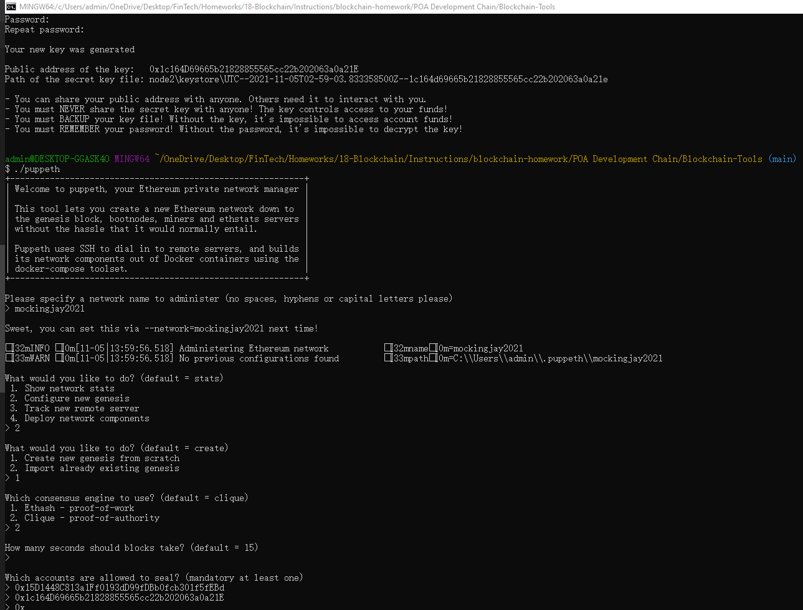
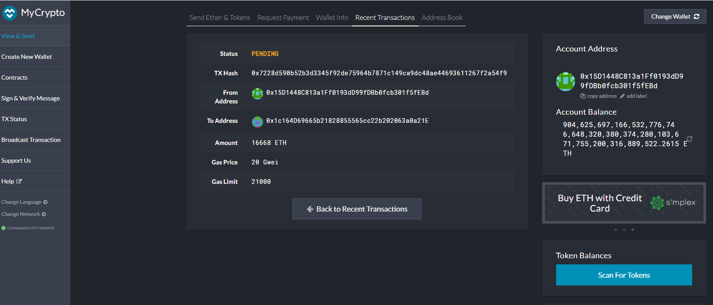

# POA Development Chain

The PoA algorithm is typically used for development and testing in testnet blockchain as it only allows specific addressess to mine/produce blocks in the network.

Before we start, we will use Go Ethereum Tools to create our very own blockchain, from the genesis block to mining tokens and making transactions. Hence, you will have to install the Go Ethereum tools, following the steps below:
1. Open your browser and navigate to the Go Ethereum Tools download page at https://geth.ethereum.org/downloads/

2. Scroll down to the "Stable Releases" section and proceed depending on your operating system.
NOTE: Do not install the most recent version of Go Ethereum Tools. The correct version to install is "Geth & Tools 1.9.7".

3. After downloading the tools archive, open your "Downloads" folder, and you will find a file named geth-alltools-darwin-amd64-1.9.7-a718daa6.tar.gz in OS X, and a file called geth-alltools-windows-amd64-1.9.7-a718daa6.zip in Windows. Note that the last numbers in the filename could vary depending on the last build available.

4. Decompress the archive in the location of your preference on your computer's hard drive, and rename the containing folder as Blockchain-Tools. 

## Creating your genesis block

1. Because the accounts must be approved, we will generate two new nodes with new account addresses that will serve as our pre-approved sealer addresses.

 * Create accounts for two nodes for the network with a separate datadir for each using geth.
   * ./geth --datadir node1 account new
   * ./geth --datadir node2 account new

2. generate your genesis block, to do it follow the steps:

Run puppeth using the command -> ./puppeth

Name your network -> mockingjay2021

Select the option 2 -> Configure a new genesis

Select the option 1 -> Create new genesis from scratch

Select the option 2 -> Clique - Proof of Authority

Paste both account addresses that we creates in the first astep, one at a time into the list of accounts to seal.

Paste them again in the list of accounts to pre-fund. There are no block rewards in PoA, so you'll need to pre-fund.

Choose NO for pre-funding the pre-compiled accounts (0x1 .. 0xff). This keeps the genesis cleaner.

Specify your network ID -> 2021

When you are back at the main menu, Select the option 2 -> Manage existing genesis.

Select the option 2 -> Export genesis configurations. This will fail to create two of the files, but you only need networkname.json.

3. With the genesis block creation completed, we will now initialize the nodes with the genesis' json file.

    * Using `geth`, initialize each node with the new `mockingjay2021.json`.
        * ./geth --datadir node1 init mockingjay2021.json
        * ./geth --datadir node2 init mockingjay2021.json

4. Now the nodes can be used to begin mining blocks.

    * Run the nodes in separate terminal windows with the commands:
        *  ./geth --datadir node1 --unlock " 0x15D1448C813a1Ff0193dD99fDBb0fcb301f5fEBd" --mine --rpc --allow-insecure-unlock
        *  ./geth --datadir node2 --unlock " 0x1c164D69665b21828855565cc22b202063a0a21E" --mine --port 30304 --bootnodes "enode://27560c164943bbcbc48c68e12428fe3b293a68d30faf34c880e299d82bf05e21e0cce10c7bf798499599a0942258cfe527a52ad3e863d888dad52d5ef75c022e@127.0.0.1:30303" --ipcdisable --allow-insecure-unlock
    * **NOTE:** Type your password and hit enter - even if you can't see it visually!

    
5. Your private PoA blockchain should now be running!

6. With both nodes up and running, the blockchain can be added to MyCrypto for testing.

 * Open the MyCrypto app, then click Change Network at the bottom left
 * Click "Add Custom Node", then add the custom network information that you set in the genesis.
* Make sure that you scroll down to choose Custom in the "Network" column to reveal more options like Chain ID.
* Type ETH in the Currency box.

* In the Chain ID box, type the chain id you generated during genesis creation.

* In the URL box type: http://127.0.0.1:8545. This points to the default RPC port on your local machine.

* Finally, click Save & Use Custom Node.

7. After connecting to the custom network in MyCrypto, it can be tested by sending money between accounts.

* Select the View & Send option from the left menu pane, then click Keystore file.
* On the next screen, click `Select Wallet File`, then navigate to the keystore directory inside your Node1 directory, select the file located there, provide your password when prompted and then click `Unlock`.

    * This will open your account wallet inside MyCrypto. 
    
    * Looks like we're filthy rich! This is the balance that was pre-funded for this account in the genesis configuration; however, these millions of ETH tokens are just for testing purposes.   
* In the `To Address` box, type the account address from Node2, then fill in an arbitrary amount of ETH.

* Confirm the transaction by clicking "Send Transaction", and the "Send" button in the pop-up window. 

* Click the `Check TX Status` when the green message pops up, confirm the logout.

* You should see the transaction go from `Pending` to `Successful` in around the same blocktime you set in the genesis.

    * You can click the `Check TX Status` button to update the status.
     
